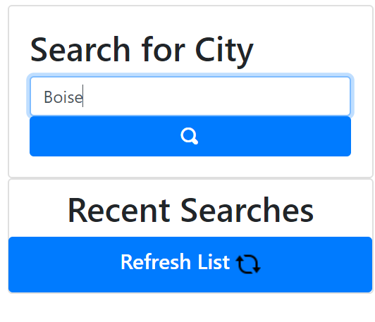

# Module 6: Weekly Challenge  
<b>Deployment</b> 
<b>Website URL:</b> https://github.com/mhans19/weather-dashboard 
<b>github URL for Repository:</b> https://mhans19.github.io/weather-dashboard/ 
 
<b>Contributor & Maintainer:</b> 
    Morgan Hansen 
    (208) 807-4913 
    mdhansen19@gmail.com 
 
<b>Purpose</b> 
    The purpose of this challenge was to retrieve weather using server-side APIs from OpenWeather and create a dynamic dashboard using a combination of HTML, CSS, JavaScript, jQuery, Bootstrap, and Moment.js. The dashboard allows for users to type in a city and view current weather and a 5-day forecast. The searched cities are stored in the local storage using the DOM and the ten most recent searched cities are displayed for later searching.For full functionality with screenshots, please see below. 
 
<b>User Story</b> 
    AS A traveler 
    I WANT to see the weather outlook for multiple cities 
    SO THAT I can plan a trip accordingly 
 
<b>Acceptance Criteria</b> 
    GIVEN a weather dashboard with form inputs 
    WHEN I search for a city 
    THEN I am presented with current and future conditions for that city and that city is added to the search history 
    WHEN I view current weather conditions for that city 
    THEN I am presented with the city name, the date, an icon representation of weather conditions, the temperature, the humidity, the wind speed, and the UV index 
    WHEN I view the UV index 
    THEN I am presented with a color that indicates whether the conditions are favorable, moderate, or severe 
    WHEN I view future weather conditions for that city 
    THEN I am presented with a 5-day forecast that displays the date, an icon representation of weather conditions, the temperature, and the humidity 
    WHEN I click on a city in the search history 
    THEN I am again presented with current and future conditions for that city 
 
<b>This application was built with the following:</b>
    <ul>
        <li>HTML</li>
        <li>CSS</li>
        <li>JavaScript</li>
        <li>jQuery</li>
        <li>Bootstrap</li>
        <li>Moment.js</li>
        <li>Server-Side API (OpenWeather API)<</li>
    </ul>     
<b>Functionality of Application</b>  
    <ol>
        <li>
        When the application loads, the user is presented with a header titled "Weather Dashboard". On the left-hand panel, the user can type and submit the name of a city by typing the name in the text box below "Search for City" and clicking the search button.  
        
        
        </li>
        <li>
        Upon submitting the city name, the right-hand panel will populated with the current weather for that city, as well as a 5-day forecast. Weather elements such as temperature, humidity, wind speed, and a UV index are presented. Icons depicting the weather are also displayed. The UV index is colored based on favorable (green), moderate (yellow), or severe (red) status. 
        
        </li>
        <li>
        As a user submits city names, the names are stored in the user's local storage. The 10 most recent searched cities are displayed in the left-hand panel, under the search bar. When the page loads, these cities populate. As a user is working within the browser, they can click the refresh button to update the list to reflect the 10 most recent searches. When a city is clicked from the search history section, that city's current and forecasted weather is displayed. 
        
        </li>
    </ol>